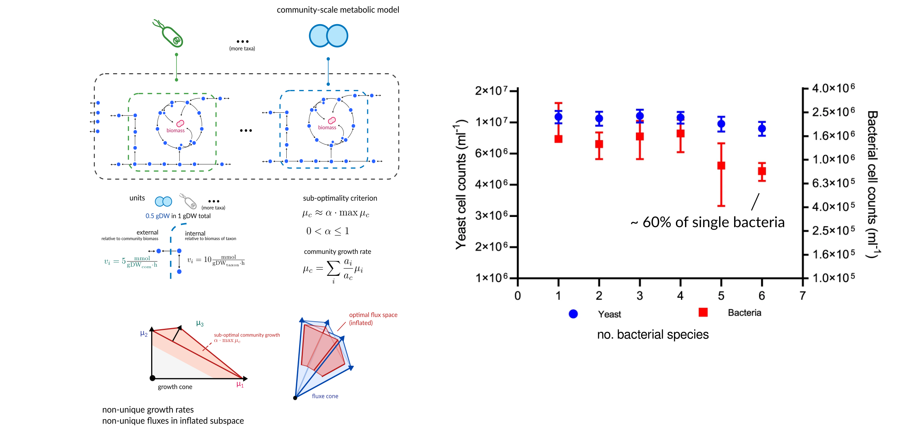
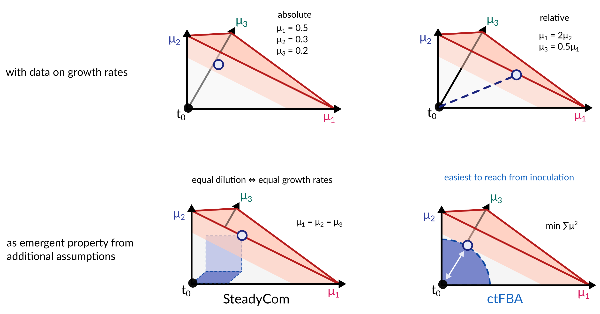

<!-- .slide: data-background="assets/backdrop.webp" class="dark no-logo" -->

# A meet and greet with MICOM

### Christian Diener

Slides: https://dienerlab.github.io/2024_micom_intro

  

<a href="https://creativecommons.org/licenses/by-sa/4.0/"><i class="bx bx-cctv"></i>CC BY-SA 4.0</a>
<a href="https://dienerlab.com"><i class="bx bxs-home"></i>dienerlab.com</a>
<a href="https://github.com/dienerlab"><i class="bx bxl-github"></i>dienerlab</a>
<a href="https://twitter.com/thaasophobia"><i class="bx bxl-twitter"></i>@thaasophobia</a>
<a href="https://mstdn.science/@thaasophobia"><i class="bx bxl-mastodon"></i>@thaasophobia</a>

---

<!-- .slide: data-background="var(--primary)" class="dark" -->

## Do we know enough of the rules to play the game?

  

Explaining the behavior of microbial communities through mechanisms by using *flux balance analysis (FBA)*.

---

## Quantifying Metabolism - Fluxes

<video width="45%" autoplay loop>
  <source src="assets/fluxes.mp4" type="video/mp4">
</video>

video courtesy of [S. Nayyak](https://twitter.com/Na_y_ak) and [J. Iwasa](https://twitter.com/janetiwasa)

---

<!-- .slide: data-background="var(--primary)" class="dark" -->

### Why fluxes?

The following are all questions about *fluxes*, not *concentrations*:

- How much butyrate is produced by a particular microbiota?
- How much fiber is broken down by <i>Bacteroides</i> in this sample?
- How fast does this pathogen grow? (note that growth rates are also fluxes)

---

## Genome-scale metabolic models (GSMMs)

----

### Reconstruction Approaches

---

## The flux cone

---

## Genome-scale metabolic models - pretty well-behaved

Schuetz et al. 2012, https://doi.org/10.1126/science.1216882 
Harcombe et al. 2013, https://doi.org/10.1371/journal.pcbi.1003091

---

## Still not unique

---

## Community-scale metabolic models - pretty rowdy

Diener et al. 2023, https://doi.org/10.1128/msystems.01270-22

----

Genus-level metabolic model for the gut microbiome of a single individual.

---

## It's all just cones

---

## How to pick solutions from the growth cone

---

That makes full community-scale metabolic models *usable*.

But even curated metabolic models for many species do not capture the full complexity of
metabolism. So are those models also *useful*?

How do we *validate* the model predictions?

---

## Is it better than the status quo?

186 metagenome samples from Swedish and Danish individuals. 
Manually curated metabolic models from the AGORA database. 
Import fluxes based on an average European diet.

Diener et al. 2020, https://doi.org/10.1128/mSystems.00606-19 
Korem, Suez, Zeevi, Weinberger et al. 2015, https://dx.doi.org/10.1126%2Fscience.aac4812 
Magnúsdóttir et al., https://doi.org/10.1038/nbt.3703

---

## Limitations

- steady state assumption: can not *really* model abundance changes
- hard to link with concentration data (for instance metabolomics)
- limited by GSMM quality, many enzymes/metabolites not identified (bias towards CCM)
- can only model growth-associated processes (no toxicity or secondary metabolism)

---

<!-- .slide: data-background="var(--gray)" class="dark" -->

## Resources

Documentation: https://micom-dev.github.io/micom

ISB Microbiome Courses (usually day 2):
[2020](https://isbscience.org/microbiome2020), [2021](https://isbscience.org/microbiome2021), [2022](https://isbscience.org/microbiome2022),
[2023](https://isbscience.org/microbiome2023)

Reconstructed model databases: https://doi.org/10.5281/zenodo.7739096

Environmental media: https://github.com/micom-dev/media

---

<!-- .slide: data-background="var(--primary)" class="dark" -->

## Practical and FAQ

**Checking for probiotic engraftment and impact.** 
We will simulate an incoming <i>B. animalis</i> for a healthy sample from the iHMP project.

Notebook: https://colab.research.google.com/github/dienerlab/2024_micom_intro/blob/main/micom.ipynb
 (you will need a Google Account)

---

<!-- .slide: data-background="assets/meduni/bridges.png" -->

# Thanks! :smile:

---

## Construction of environmental media

